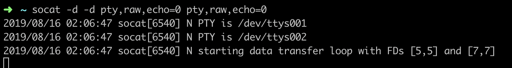
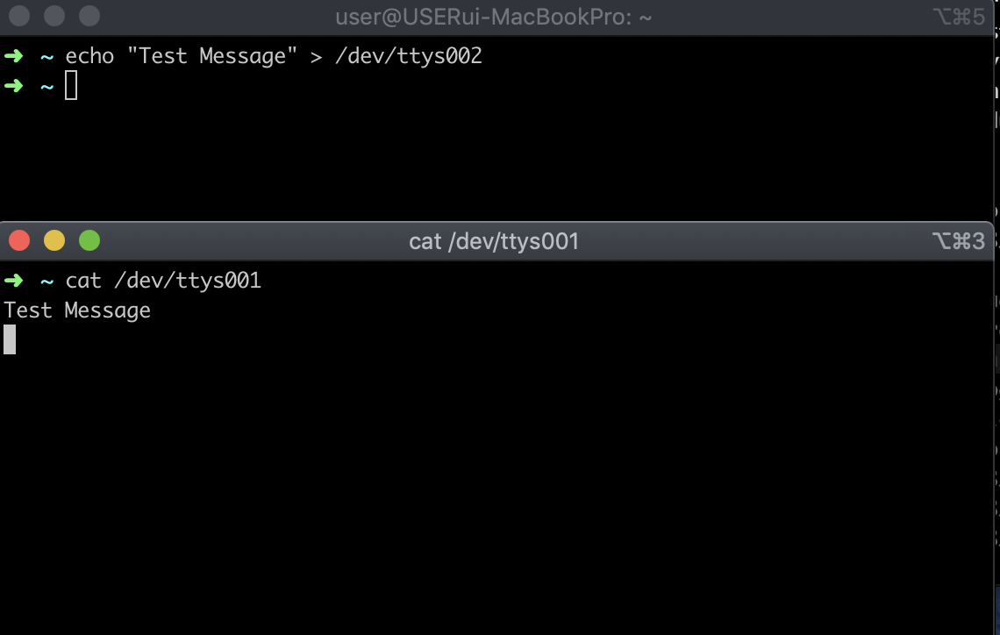
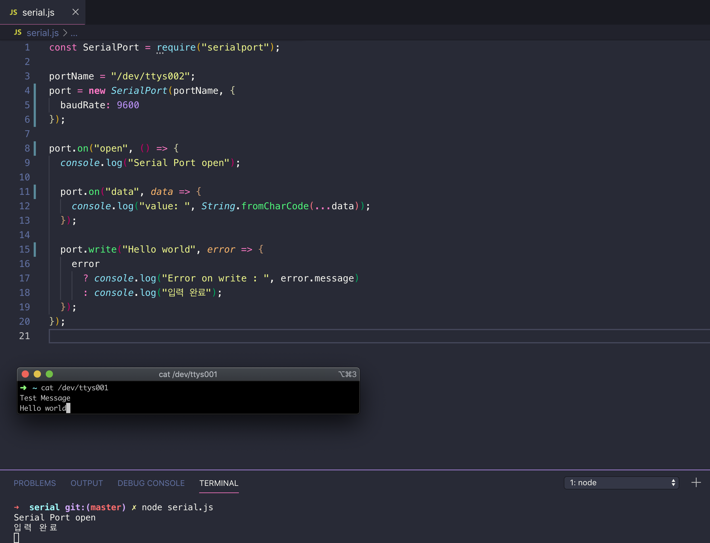

# Node.js 가상포트로 시리얼 통신 ( Mac )

## 1. 가상포트 생성 
> **각 터미널은 새로운 세션(terminal 0~2 으로 칭함)으로 열어 명령어 실행**

* socat 설치
    ```
    brew install socat
    ```

* socat 을 이용한 가상 포트 생성 **terminal 0**
    ```
    socat -d -d pty,raw,echo=0 pty,raw,echo=0
                    -받는쪽-        -보낼쪽-        
    ```
     >받는쪽과 보낼쪽을 구분 했지만 양방향으로 가능
    
     아래와 같은 포트가 생성
    

 ## 2. 가상포트 테스트

  * 값 출력(받을) 준비  **terminal 1**
    ```
    cat /dev/ttys001
    ```
* 값 입력  **termibal 2**
    ```
    echo "TEST Message" > /dev/ttys002
    ```
    > **\> 꺽쇠 명령어는 좌측 명령어를 우측에 입력 또는 생성
* 결과
  아래와 같이 나오면 가상포트 생성 성공
  

## 3. 시리얼 통신 연결
serialport 패키지를 이용   

* serialport 설치
    ```
    npm install serialport
    ```
* 직렬 포트 열기
    ```
    const SerialPort = require('serialport')
        const port = new SerialPort('/dev/ttys002', {
        baudRate: 9600
    })
    ```
* 값 입력 및 받기
    ```
    port.on("open", () => {
        console.log("Serial Port open");

        port.on("data", data => {
            console.log("value: ", String.fromCharCode(...data));
        }); // 포트모드 "flowing mode"
        
        /*
        port.on('readable', function () {
            console.log('Data:', port.read())
        }) // 포트모드 "paused mode"
        */

        port.write("Hello world", error => {
            error
            ? console.log("Error on write : ", error.message)
            : console.log("입력 완료");
        }); // callback 으로 error 를 받음
    });
    ```

> **자세한 사용법은 [이곳](http://www.google.co.kr) 참조

## 4. 최종 결과


## 참고 문서
 * [socat](https://stackoverflow.com/questions/52187/virtual-serial-port-for-linux)
 * [serialport](https://serialport.io/docs/guide-usage)

   


